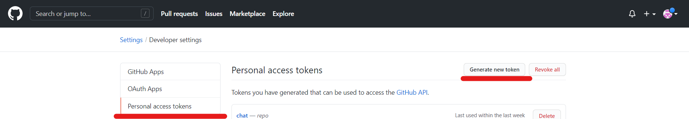

## Exadel Internship project from NASA-team (Novogrodski Andrew & Sazonova Anna)
---
  Для реализации данного проекта была сделана ветка из официального репозитория [RocketChat](https://github.com/RocketChat/Rocket.Chat) и настроен web hook для интеграции с [GitLab репозиторием нашего проекта](https://gitlab.com/Andrew-Novogrodski/Rocket-Chat).





---
В GitLab создаем проект и настаиваем его согласно URL нашего репозитория в Github и созданного там token  (Menu-Projects-Create new project).


Выбираем наш проект и импортируем его.

Подробнее об этом можно узнать [тут](https://docs.gitlab.com/ee/ci/ci_cd_for_external_repos/github_integration.html).

---
Для стадий build и testing в  [Microsoft Azure](https://azure.microsoft.com/ru-ru/) создана VM (Standard D2as_v4 (2 vcpus, 8 GiB memory), Linux (ubuntu 20.04)) c дополнительным открытием в Networking-Inbound port rules-Add inbound security rule порта :3000.

---
Для работы с Gitlab (исполнение Jobs) на данной VM установлен 
[GitLab Runner](https://docs.gitlab.com/runner/install/linux-manually.html).


```
curl -LJO "https://gitlab-runner-downloads.s3.amazonaws.com/latest/deb/gitlab-runner_amd64.deb"

sudo dpkg -i gitlab-runner_amd64.deb

gitlab-runner -v

sudo usermod -aG docker gitlab-runner
```
[Регистрируем](https://docs.gitlab.com/runner/register/index.html#linux) два specific runners, данные для этого берем в Gitlab-Settings-CI/CD-Runners: 

```
sudo gitlab-runner register
```


- для выполнения стадий build, testing (deploy and html) - c docker executor;
  
  

- для выполнения стадий deployk8s - c shell executor.

  

В Gitlab видим, что созданные раннеры активны:


Для работы с Google Kubernetes Engine (GKE) устанавливаем:
- [kubectl](https://kubernetes.io/ru/docs/tasks/tools/install-kubectl/#%D1%83%D1%81%D1%82%D0%B0%D0%BD%D0%BE%D0%B2%D0%BA%D0%B0-%D0%B4%D0%B2%D0%BE%D0%B8%D1%87%D0%BD%D0%BE%D0%B3%D0%BE-%D1%84%D0%B0%D0%B9%D0%BB%D0%B0-kubectl-%D1%81-%D0%BF%D0%BE%D0%BC%D0%BE%D1%89%D1%8C%D1%8E-curl-%D0%B2-linux)
```
 curl -LO https://storage.googleapis.com/kubernetes-release/release/`curl -s https://stox/amd64/kubectl

 chmod +x ./kubectl

  sudo mv ./kubectl /usr/local/bin/kubectl

 kubectl version --client
```
    
- [google cloud SDK](https://cloud.google.com/sdk/docs/install)
```
 echo "deb [signed-by=/usr/share/keyrings/cloud.google.gpg] https://packages.cloud.googlgle-cloud-sdk.list

 sudo apt-get install apt-transport-https ca-certificates gnupg
 
 curl https://packages.cloud.google.com/apt/doc/apt-key.gpg | sudo apt-key --keyring /us
 
 sudo apt-get update && sudo apt-get install google-cloud-sdk
 ```

-  [helm](https://helm.sh/docs/intro/install/#from-script)
```
 curl -fsSL -o get_helm.sh https://raw.githubusercontent.com/helm/helm/master/scripts/get-helm-3

 chmod 700 get_helm.sh

 ./get_helm.sh

```
Для версии Linux (ubuntu 20.04) обязательно нужно удалить файл .bash_logout из домашней папки gitlab-runner, иначе при запуске pipeline будет возникать ошибка "[Job failed (system failure): preparing environment](https://docs.gitlab.com/runner/faq/index.html#job-failed-system-failure-preparing-environment)".

```
cd /home/gitlab-runner
rm .bash_logout
```
Позднее мы еще вернемся к описанию настройки этих установленных приложений согласно нашего кластера, который создадим ниже.

---
Настройка соединения с Google Cloud и запуск Kubernetes:

- Создаем учетную запись и привязываем к ней Google Cloud
- Переходим в Cloud console, создаем проект и активируем нужные API (Kubernetes Engine, Cloud Storage, Cloud DNS API)
- Установка соединения рабочей машины на базе Linux Ubuntu 20.04 c Google Cloud через Google SDK:
  ```
    echo "deb [signed-by=/usr/share/keyrings/cloud.google.gpg] https://packages.cloud.google.com/apt cloud-sdk main" | sudo tee -a /etc/apt/sources.list.d/google-cloud-sdk.list

    sudo apt-get install -y apt-transport-https ca-certificates gnupg
    
    curl https://packages.cloud.google.com/apt/doc/apt-key.gpg | sudo apt-key --keyring /usr/share/keyrings/cloud.google.gpg add -
    
    sudo apt-get update && sudo apt-get install -y google-cloud-sdk
    
    gcloud init
    ```
    Создается ссылка для валидации, переходим по ней, логинимся и заполняем нужные данные в командной строке (верификационный ключ)

    Устанавливаем kubectl: 
    ```
    sudo apt install kubectl
    ```
    Устанавливаем Helm Charts: 
    ```
    wget https://get.helm.sh/helm-v3.6.3-linux-amd64.tar.gz
    tar -xf helm-v3.6.3-linux-amd64.tar.gz
    sudo mv linux-amd64/helm /bin/ && rm -rf linux-amd64/ && rm helm-v3.6.3-linux-amd64.tar.gz
    ```

    Создаем кластер:
    - Способ №1:
        ```
        gcloud container clusters create <name>
        ```
        Забираем креды:
    
        ```
        gcloud container clusters get-credentials <name>
        ```
    - Способ №2: 
    
        Создать кластер можно также и средствами самого GitLab, что даже более удобно, так как потом не придется прописывать сертифит и токены.

        Переходим во вкладку Infrastructure -> Kubernetes cluster -> Create new cluster
        Далее нужно пройти валидацию и заполнить нужные характеристики (3 ноды n1-standard-2, zoзона ne us-central1-a. Характеристики 2 cpu 8 gb ram).

    - Способ №3:
    
        Создаем кластер в Google Cloud -> Kubernetes Engine -> Create - Standart Configure - Name - Выбираем Zone
        Выбираем нужные характеристики (3 ноды n1-standard-2, zoзона ne us-central1-a. Характеристики 2 cpu 8 gb ram) и запускаем.

---
После создания кластера инициализируем доступ к нему для нашего ранера:
```
sudo -i -u gitlab-runner
gcloud init 
```
Переходим со сформированной ссылке, логинимся в наш Google-аккаунт и копируем верификационный ключ.
 

Далее выбираем наш уже созданный кластер и после вставляем ссылку, скопированную из GCP:


---
Для мониторинга установливаем prometheus и grafana stack:
1. Добавляем нужные репозитории и обновляем список:
```
helm repo add stable https://charts.helm.sh/stable

helm repo add prometheus-community https://prometheus-community.github.io/helm-charts

Helm repo update
```
2. Создаем custom-values.yaml манифест, для дополнительных настроек стэка:
```
coreDns:
  enabled: false

kubeDns:
  enabled: true

prometheusOperator:
  createCustomResource: false

alertmanager:
  alertmanagerSpec:
    storage:
      volumeClaimTemplate:
        spec:
          accessModes: ["ReadWriteOnce"]
          resources:
            requests:
              storage: 8Gi

prometheus:
  prometheusSpec:
    storageSpec:
      volumeClaimTemplate:
        spec:
          accessModes: ["ReadWriteOnce"]
          resources:
            requests:
              storage: 8Gi
EOF
```

 и вводим команду:
```
cat <<EOF > custom_values.yaml
```

3. Устанавливаем стэк командой:
helm install grafana-prometheus \
  -n monitoring \
  -f custom_values.yaml \
  --version 17.0.3 \
  prometheus-community/kube-prometheus-stack
---
 
Система backup в проекте основана на создание GCS bucket и инструменте [Velero](https://github.com/vmware-tanzu/velero-plugin-for-gcp#Create-an-GCS-bucket).

- [Создание Google Storage buckets](https://cloud.google.com/storage/docs/creating-buckets):
  1. Заходим в Google Cloud Console -> Cloud Storage Browser
  2. Нажимаем Create a bucket -> Continue
  3. Выбираем имя, место хранения, тип хранилища и тип доступа к хранилищу.
  4. Нажимаем Create.

- Настройка прав доступа для Velero:
  1. Присваиваем значение переменной 
      ```
      BUCKET=<имя нашего bucket>
      ```
  2. Присваиваем значение переменной 
      ```
      PROJECT_ID=$(gcloud config get-value project)
      ```
  3. Создаем service account: 
      ```
      gcloud iam service-accounts create velero --display-name "Velero service account"
      ```
  4. Затем присваиваем значение переменной (оно будет равно значению поля email из команды gcloud iam service-accounts list)
      ```
      SERVICE_ACCOUNT_EMAIL 
      ``` 
  5. Добавляем необходимые разрешения:
      ```
      ROLE_PERMISSIONS=(
        compute.disks.get
        compute.disks.create
        compute.disks.createSnapshot
        compute.snapshots.get
        compute.snapshots.create
        compute.snapshots.useReadOnly
        compute.snapshots.delete
        compute.zones.get
        )

        gcloud iam roles create velero.server \
        --project $PROJECT_ID \
        --title "Velero Server" \
        --permissions "$(IFS=","; echo "${ROLE_PERMISSIONS[*]}")"
    
        gcloud projects add-iam-policy-binding $PROJECT_ID \
        --member serviceAccount:$SERVICE_ACCOUNT_EMAIL \
        --role projects/$PROJECT_ID/roles/velero.server
    
        gsutil iam ch serviceAccount:$SERVICE_ACCOUNT_EMAIL:objectAdmin gs://${BUCKET}
      ```

  6. Создаем service account key:
      ```
        gcloud iam service-accounts keys create credentials-velero \
        --iam-account $SERVICE_ACCOUNT_EMAIL
      ```

- Установка Velero:
    ```
    velero install \
     --provider gcp \
     --plugins velero/velero-plugin-for-gcp:v1.2.0 \
     ---secret-file ./credentials-velero
    ```

    Основные команды Velero:
    ```
    velero backup-location get #посмотреть используемое хранилище
    velero backup get #просмотр списка backup
    velero restore get #просмотр списка restore
    velero backup create <имя backup> [дополнительные опции] #создание backup
    velero restore create <имя restore> --from-backup <имя backup> #восстановление из backup
    velero create schedule <имя расписания>  --schedule=”@every ..” либо “* * * * *”
    ```


---
В наш репозиторий пушим наш [Dockerfile](Dockerfile) и наш 
[Pipeline](.gitlab-ci.yml)